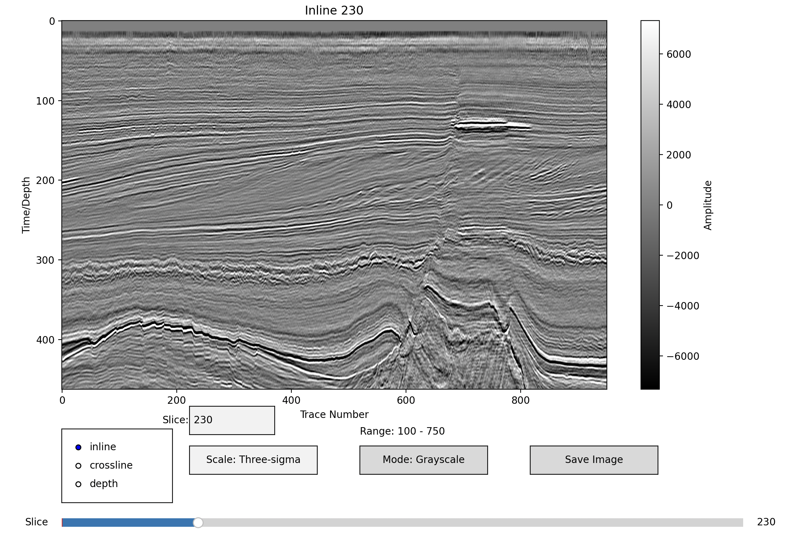
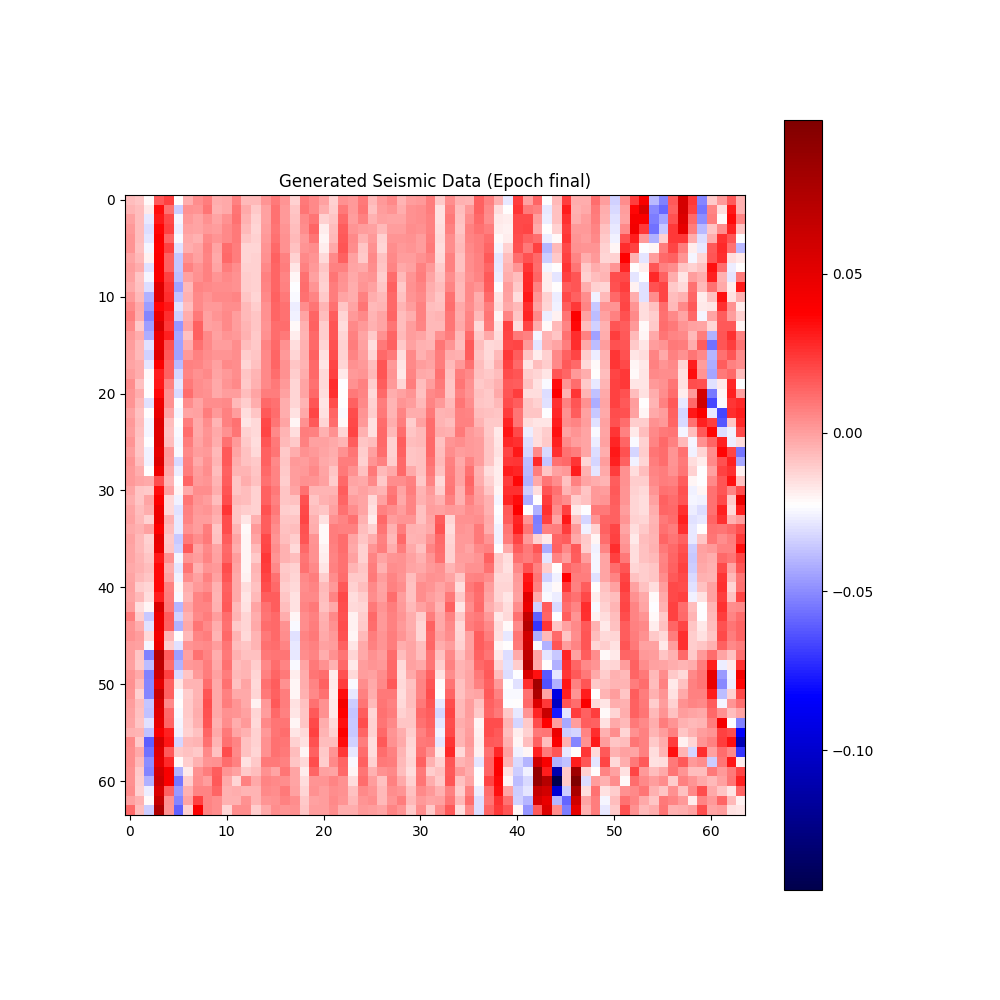
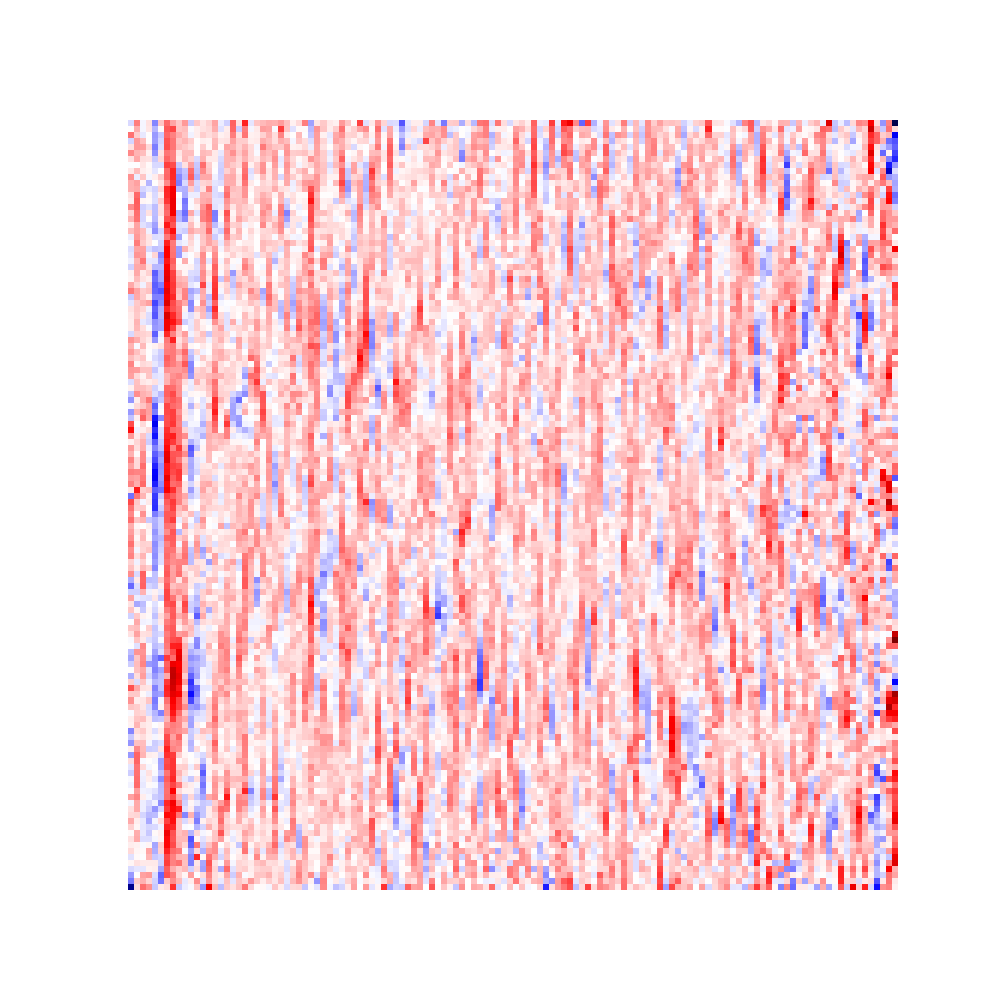

# 1. Визуализатор:

src/SegReader.py - обработчик segy файла
src/SegPlot.py - плот для визуализации, планируется добавить ешё методы
src/SegInteractPlot.py - класс для интерактивной визуализации

# 2. Модель диффузии:

Модель Unet.
Генерация на 64x64 приемлема, остальные неправдоподобные

# 3. Ошибки и предложения:
## 3.1 Визуализатор:
- Можно попробовать реализовать 3D режим:
  - обрезка по трем плоскостям
  - прозрачный режим по чуствительности
- Добавить обработки данных (лучше как отдельный класс, стоит оценить производительность):
  - Выделение мощности сигнала
  - изменение усиления
  - изменение цветовой шкалы и т.д.
- Можно реализовать ограничение слайсов по вертикали и горизонтали;
- Из SegReader можно взять координаты, но я бы их перед этим проверил

## 3.2 Модель диффузии
- Не успеваю оформить код
- В следующем экперименте я бы увеличил размер ядра свертки, его следует связать с длинной волны! В последнем эксперименте я увеличил глубину UNET.
- Я бы генерировал литологию, а подом уже разрез, кажется есть такая реализация на гит. 
  - Это долго, но надежно
  - Ещё нужно сделать обработку, чтобы запись была реалистичной
- Добавление шума происходит неверно
- Даталоадер масштабирует данные, то есть выдумывает новые параметры для волнового поля
- Требуется больше времени чтобы оценить loss при добавлении фич
- Колебания у целевых данных мельчайшие, следует рассмотреть способы предобработки

## 3.3 Прочее
- Не реализованна оптимизация у SegReader
- Код не проверен на 64x архитектуре, как минимум должен запуститься другой engine. По идее все должно пойти без исправлений.
- Для улучшения задачи стоит поговорить с сейсмиками как они обрабатывают данные)
- Реализовать деконволюцию и свертку, это избавить модель от задачи генерировать волновое поле
  - у меня есть нестандартное решение этой проблемы в диссертации, но оно долгое
  - стоит получше изучить мат часть

## Процесс решения задач:
- 1 этап
  - Разбор внутренностей segfast - 4 часа, сделан jupyter - решения перенесены в проект на claude:
  - визуализация - 1 день
  - МЛ - 1 день
  - Результат был отправлен в четверг
- 2 Этап
  - исправление ошибок обучения и эксперименты - 1 день  
  - рефакторинг первого этапа - 4 часа
- 3 Время обучения(ий) ≈ 3 ночи.

