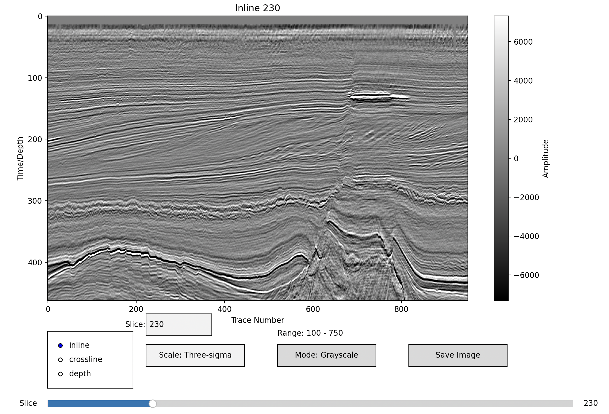
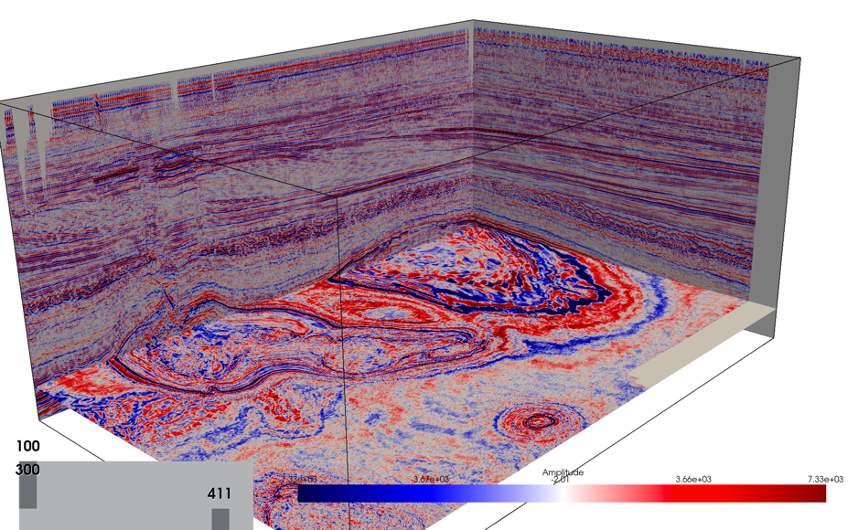

# Seismic Data Visualization Tool

A Python-based tool for visualizing and analyzing SEG-Y seismic data files with both 2D interactive and 3D visualization capabilities (built on top of [segfast](https://github.com/analysiscenter/segfast) reader, tested on MacOS, reader optimization pending).

## Project Structure

```
.
├── requirements.txt      # Project dependencies
├── tools/               # Utility scripts and tools
├── tests/               # Test files
├── models/              # Trained ML models storage
├── docs/                # Documentation and images
├── data/                # Data storage
│   ├── reader/          # Cache for reader metadata
│   ├── images/          # Exported visualizations
│   ├── models/          # Model checkpoints
│   └── sgy/             # SEG-Y data files
└── src/                 # Source code
    ├── SegInteractPlot.py     # 2D interactive visualization
    ├── Seg3DVisualization.py  # 3D visualization
    ├── SegReader.py           # SEG-Y file reader
    ├── SegPlot.py            # Base plotting utilities
    └── config.py             # Configuration settings
```

## Features

- Interactive 2D visualization with slice navigation
- 3D visualization with dynamic slice control
- Support for inline, crossline, and depth slices
- Statistical analysis of seismic data
- Export capabilities for visualizations
- Metadata caching for faster subsequent loads

## Notes
- Current version uses segfast's default settings, no performance optimization applied
- Primary testing done on MacOS
- Memory usage depends on SEG-Y file size

## Interactive 2D Visualizer



Features:
- Slice navigation through inline, crossline, and depth dimensions
- Color scale toggling
- Image export functionality
- Real-time statistical analysis

## 3D Visualizer



Features:
- Simultaneous view of inline, crossline, and depth slices
- Interactive slice position control
- Dynamic amplitude scaling
- Responsive 3D navigation

## Installation

```bash
pip install -r requirements.txt
```

## Usage

Basic example to start the interactive 2D visualizer:

```python
from src.SegReader import SeqReader
from src.SegInteractPlot import SegInteractPlot

reader = SeqReader("path/to/your/seismic.sgy")
interactive_plot = SegInteractPlot(reader, reader.get_coordinates(), reader.get_statistics())
interactive_plot.show()
```

For 3D visualization:

```python
from src.SegReader import SeqReader
from src.Seg3DVisualization import PyVistaSeg3DVisualization

reader = SeqReader("path/to/your/seismic.sgy")
viz = PyVistaSeg3DVisualization(reader)
viz.show()
```